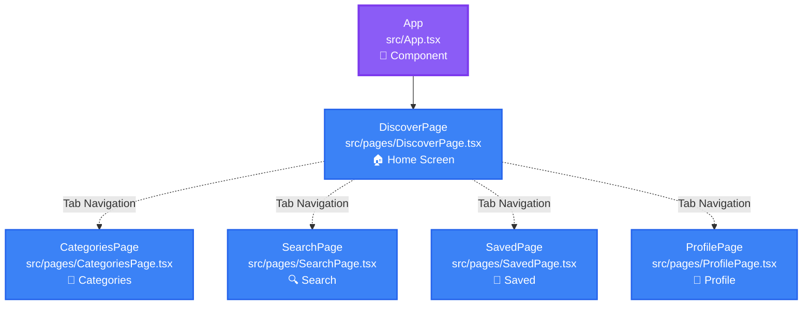

# Anima App Flow - Visual Documentation

## 📱 Application Structure

This document recreates the flow shown in the Anima Playground at dev.animaapp.com

---

## 🗺️ Flow Diagram (Mermaid)



---

## 📋 Screen Details

### 1. App (Component)
- **File**: `src/App.tsx`
- **Type**: Root Component
- **Purpose**: Application entry point
- **Navigation**: Routes to DiscoverPage as home

### 2. DiscoverPage (Screen) 🏠
- **File**: `src/pages/DiscoverPage.tsx`
- **Type**: Main Screen / Home
- **Purpose**: Browse and discover content
- **Icon**: Home icon
- **Props**: `/` (root path)

### 3. CategoriesPage (Screen)
- **File**: `src/pages/CategoriesPage.tsx`
- **Type**: Navigation Screen
- **Purpose**: Browse items organized by categories
- **Icon**: Grid icon
- **Props**: `categories` (array)

### 4. SearchPage (Screen)
- **File**: `src/pages/SearchPage.tsx`
- **Type**: Navigation Screen
- **Purpose**: Search functionality for finding items
- **Icon**: Search icon
- **Props**: `search` (string)

### 5. SavedPage (Screen)
- **File**: `src/pages/SavedPage.tsx`
- **Type**: Navigation Screen
- **Purpose**: Display user's saved/bookmarked items
- **Icon**: Bookmark icon
- **Props**: `saved` (array)

### 6. ProfilePage (Screen)
- **File**: `src/pages/ProfilePage.tsx`
- **Type**: Navigation Screen
- **Purpose**: User profile, settings, and account management
- **Icon**: User icon
- **Props**: `profile` (object)

---

## 🧭 Navigation Structure

### Tab Navigation (Bottom Navigation Bar)
1. **Discover** → DiscoverPage (Home)
2. **Categories** → CategoriesPage
3. **Search** → SearchPage
4. **Saved** → SavedPage
5. **Profile** → ProfilePage

---

## 🎨 Visual Layout

```
┌─────────────────────────────────────┐
│           CategoriesPage            │
│        (categories prop)            │
└─────────────────────────────────────┘
                 ↕
┌─────────────────────────────────────┐
│            SearchPage               │
│          (search prop)              │
└─────────────────────────────────────┘
                 ↕
┌─────────────────────────────────────┐
│            SavedPage                │
│          (saved prop)               │
└─────────────────────────────────────┘
                 ↕
┌─────────────────────────────────────┐
│           ProfilePage               │
│         (profile prop)              │
└─────────────────────────────────────┘
                 ↕
┌─────────────────────────────────────┐
│              App (Root)             │ ──→ ┌──────────────────┐
│                                     │     │  DiscoverPage    │
└─────────────────────────────────────┘     │  (Home Screen)   │
                                            └──────────────────┘
```

---

## 🔄 Connection Types

### Direct Navigation
- **App → DiscoverPage**: Initial routing from root component to home screen

### Tab Navigation
- **DiscoverPage ↔ All Other Pages**: Bottom tab navigation allows switching between main sections

---

## 📦 Export Formats

This flow can be imported to Anima using:
- `anima-flow-recreation.json` - Full configuration file
- This markdown file - Visual documentation

---

## 🛠️ Technical Notes

- **Framework**: React
- **Language**: TypeScript (`.tsx` files)
- **Navigation Pattern**: Tab-based navigation with 5 main sections
- **Architecture**: Component-based with centralized App router

---

*Generated from: https://dev.animaapp.com/*
*Date: 2025-11-17*

